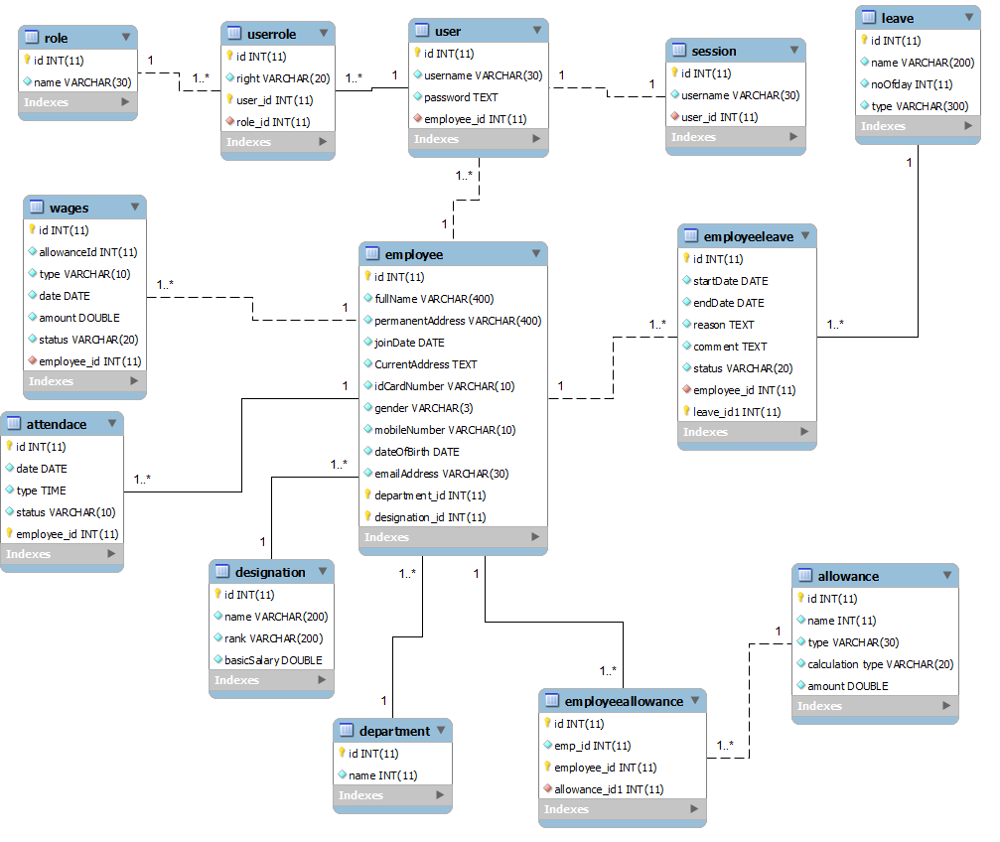
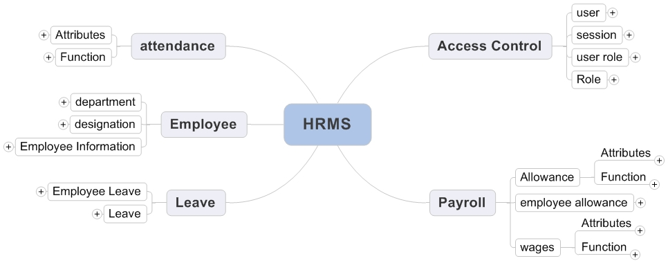
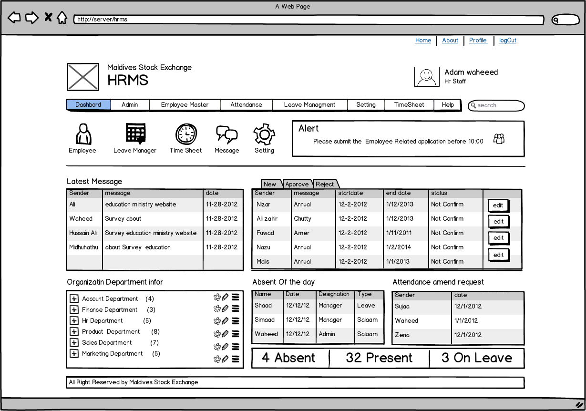
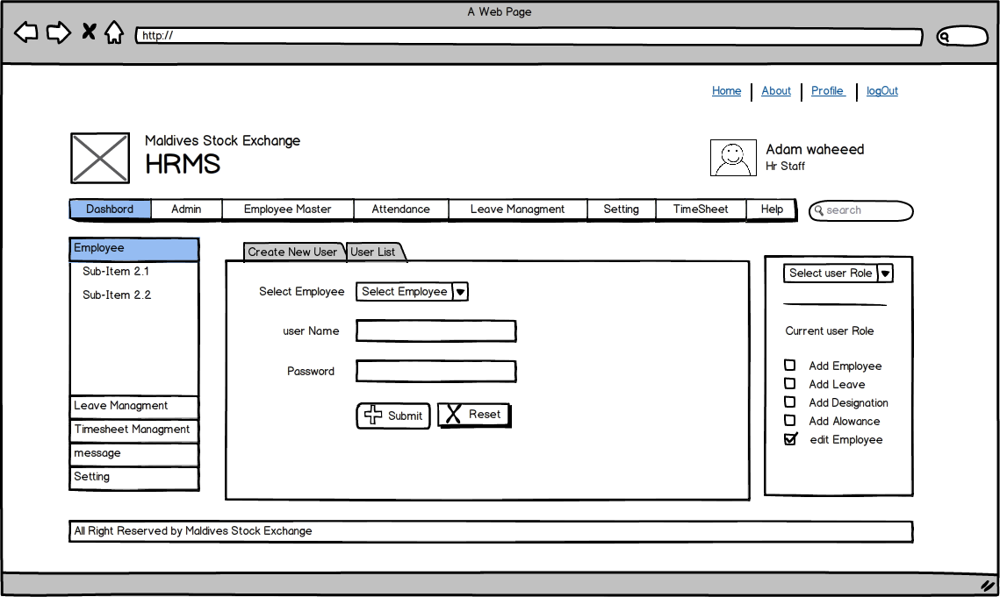
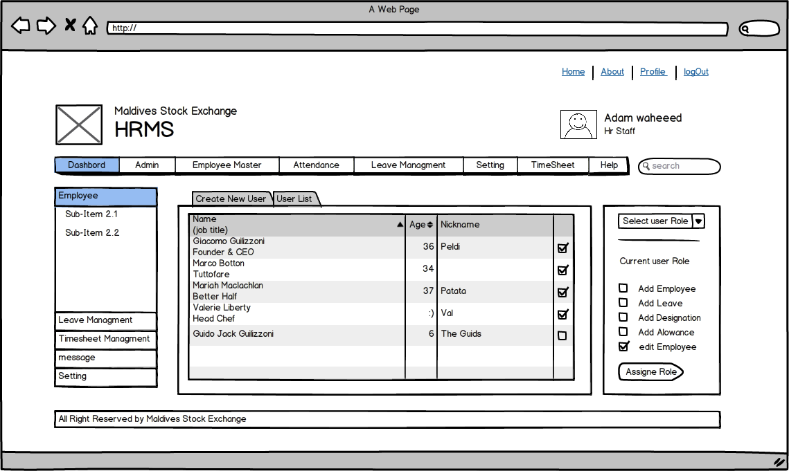
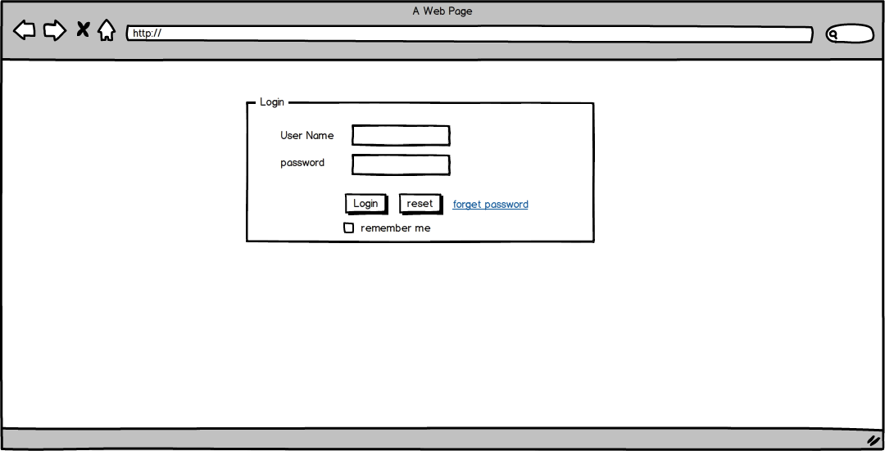
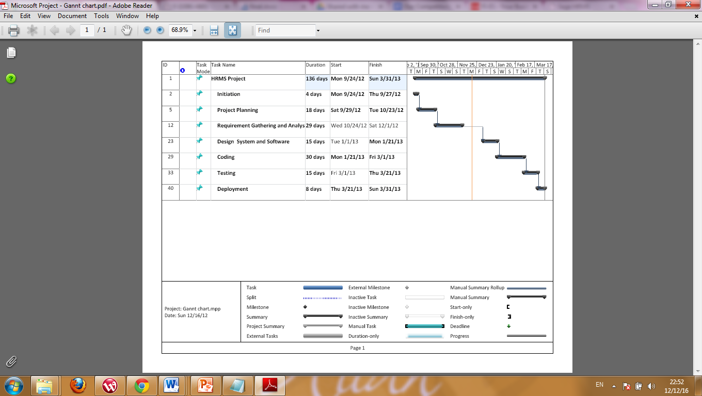
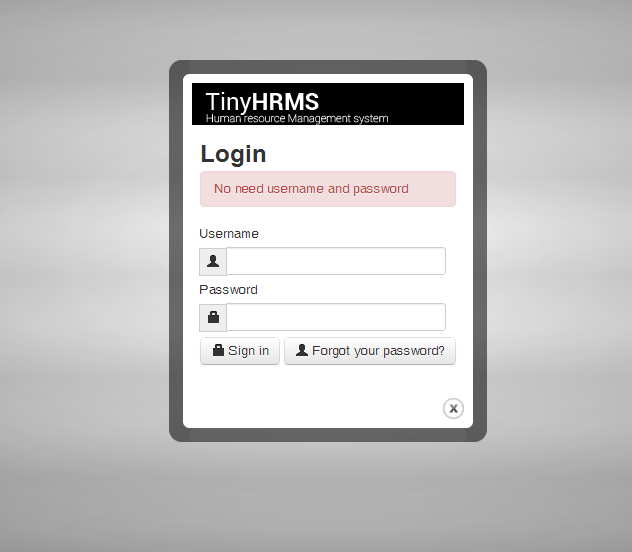
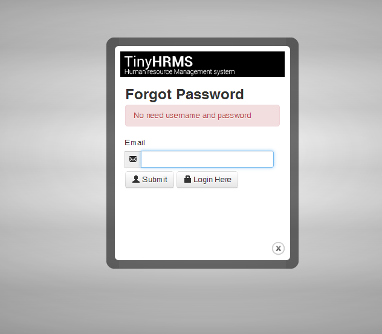
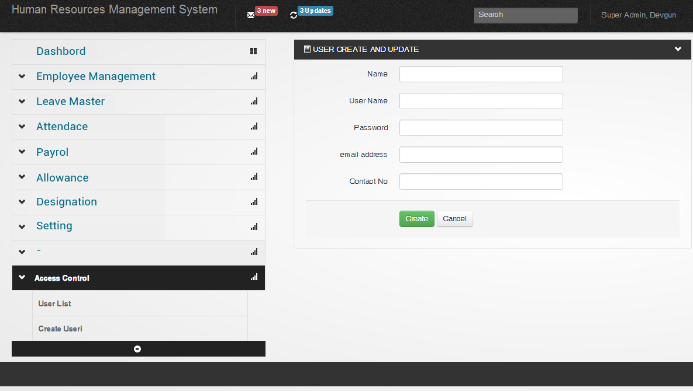

|   MODULE FINAL YEAR PROJECT 1    |
|:--------------------------------:|
| Human Resource Management System |
|            SimpleHRMS            |
|                                  |
|                                  |
|                                  |

|     |
|-----|

**  **

# Acknowledgement

This project, Human Resource Management Software that is to be developed for Maldives Stock Exchange, is done as the final year project, as a part of course titled “Bachelors of Information Technology (Hons)”. We are really thankful to our lecturer Mr. Ibrahim Waheed for his invaluable guidance and assistance, without which the accomplishment of the task would have never been possible. We also thank the supervisors who assisted us throughout the planning phase of the project, Mr. Abdul Waris, and Mr. Student X Mauroof.

We are also thankful to the employees of Maldives Stock Exchange, especially, Mr. Abdulla Mustafa for providing us relevant information and necessary clarifications required for the project.

# Declaration

I hereby acknowledge that all the information given above is true and correct to the best of my knowledge.

> Name : STUDENT X
>
> Signature :
>
> Date :20-Dec-
>
> Name : STUDENT Y
>
> Signature :
>
> Date : 20-Dec-
>
> Name : STUDENT Z
>
> Signature :
>
> Date : 20-Dec-

# Contents

[Acknowledgement [1](#acknowledgement)](#acknowledgement)

[Declaration [2](#declaration)](#declaration)

[List of Tables and Figures [5](#list-of-tables-and-figures)](#list-of-tables-and-figures)

[List of Abbreviation and Acronyms [6](#list-of-abbreviation-and-acronyms)](#list-of-abbreviation-and-acronyms)

[Abstract [7](#abstract)](#abstract)

[Chapter 1: Proposal [8](#chapter-1-proposal)](#chapter-1-proposal)

[1.1. Introduction [8](#introduction)](#introduction)

[1.2 Stakeholder Summary [9](#stakeholder-summary)](#stakeholder-summary)

[1.3 Benefits and Constraints of Proposed System [10](#benefits-and-constraints-of-proposed-system)](#benefits-and-constraints-of-proposed-system)

[Chapter 2: Requirement Definition and Design Specification [11](#chapter-2-requirement-definition-and-design-specification)](#chapter-2-requirement-definition-and-design-specification)

[2.1 Introduction [11](#introduction-1)](#introduction-1)

[2.2 Modules of HRMS [11](#modules-of-hrms)](#modules-of-hrms)

[2.2.1 Attendance Management [11](#attendance-management)](#attendance-management)

[2.2.2 Payroll Management [11](#payroll-management)](#payroll-management)

[2.2.3 Leave Management [11](#leave-management)](#leave-management)

[2.2.4 Access Control [12](#access-control)](#access-control)

[2.2.5 Employee Information [12](#employee-information)](#employee-information)

[2.3 Main Users of the System [12](#main-users-of-the-system)](#main-users-of-the-system)

[2.4 Expanded Use Cases [14](#expanded-use-cases)](#expanded-use-cases)

[Chapter 3: Design Specification [36](#chapter-3-design-specification)](#chapter-3-design-specification)

[3.1 Introduction [36](#introduction-2)](#introduction-2)

[3.2 Database Design [37](#database-design)](#database-design)

[3.3 Data Dictionary [38](#data-dictionary)](#data-dictionary)

[6.5.1. Structure for table allowance [38](#structure-for-table-allowance)](#structure-for-table-allowance)

[6.5.2. Structure for table attendance [38](#structure-for-table-attendance)](#structure-for-table-attendance)

[6.5.3. Structure for table department [38](#structure-for-table-department)](#structure-for-table-department)

[6.5.4. Structure for table designation [39](#structure-for-table-designation)](#structure-for-table-designation)

[6.5.5. Structure for table employee [39](#structure-for-table-employee)](#structure-for-table-employee)

[6.5.6. Structure for table employee allowance [39](#structure-for-table-employee-allowance)](#structure-for-table-employee-allowance)

[6.5.7. Structure for table employee leave [39](#structure-for-table-employee-leave)](#structure-for-table-employee-leave)

[6.5.8. Structure for table leave [40](#structure-for-table-leave)](#structure-for-table-leave)

[6.5.9. Structure for table role [40](#structure-for-table-role)](#structure-for-table-role)

[6.5.10. Structure for table session [40](#structure-for-table-session)](#structure-for-table-session)

[6.5.11. Structure for table user [40](#structure-for-table-user)](#structure-for-table-user)

[6.5.12. Structure for table user role [41](#structure-for-table-user-role)](#structure-for-table-user-role)

[6.5.13. Structure for table wages [41](#structure-for-table-wages)](#structure-for-table-wages)

[3.4 Web-based Structural Design [42](#web-based-structural-design)](#web-based-structural-design)

[3.5 Interface mockups [43](#interface-mockups)](#interface-mockups)

[Chapter 4: Implementation and Testing [46](#chapter-4-implementation-and-testing)](#chapter-4-implementation-and-testing)

[4.1 Testing [46](#testing)](#testing)

[Chapter 5: Project Evaluation [47](#chapter-5-project-evaluation)](#chapter-5-project-evaluation)

[5.1 Introduction [47](#introduction-3)](#introduction-3)

[5.2 Challenges [47](#challenges)](#challenges)

[5.2.1 In Finding Requirements [47](#in-finding-requirements)](#in-finding-requirements)

[5.2.2 Challenges of working as a Team [48](#challenges-of-working-as-a-team)](#challenges-of-working-as-a-team)

[5.2.3 External Events [48](#external-events)](#external-events)

[5.3 Further Improvement and Future Work [48](#further-improvement-and-future-work)](#further-improvement-and-future-work)

[Conclusion [50](#conclusion)](#conclusion)

[References [51](#references)](#references)

[Appendix A: HRMS survey report [53](#appendix-a-hrms-survey-report)](#appendix-a-hrms-survey-report)

[Appendix B: Gantt Chart [54](#appendix-b-gantt-chart)](#appendix-b-gantt-chart)

[Appendix C: Screenshots of the System [55](#appendix-c-screenshots-of-the-system)](#appendix-c-screenshots-of-the-system)

[Appendix D: Team Members’ Contributions [57](#appendix-d-team-members-contributions)](#appendix-d-team-members-contributions)

# List of Tables and Figures

[Table 1: Stakeholder Summary [11](#_Toc344044979)](#_Toc344044979)

[Table 2: Needs and Features [17](#_Toc344044980)](#_Toc344044980)

[Table 3: Minimum Requirements for Operation Environment [21](#_Toc344044981)](#_Toc344044981)

[Table 4: Project Resource Requirements and Estimated Costs [22](#_Toc344044982)](#_Toc344044982)

[Table 5: Risk Management Plan [25](#_Toc344044983)](#_Toc344044983)

[Table 6: Work Items List [26](#_Toc344044984)](#_Toc344044984)

[Figure 1: Waterfall Model [24](#_Toc344046565)](#_Toc344046565)

[Figure 2: Use case Diagram [1](#_Toc344046566)](#_Toc344046566)

[Figure 3: Analysis Class Diagram [26](#_Toc344046567)](#_Toc344046567)

[Figure 4: ER Diagram [43](#_Toc344046568)](#_Toc344046568)

[Figure 5: Web-based Structure Design [48](#_Toc344046569)](#_Toc344046569)

[Figure 6: Parallel Implementation [53](#_Toc344046570)](#_Toc344046570)

# List of Abbreviation and Acronyms

> **SimpleHRMS**: Name of the product

**HRMS**: Human Resource Management System

> **HR Staff**: Human Resource Department Staff
>
> **MVC**: Model View Control
>
> **MD5**: Message-Digest Algorithm that produces a 128-[bit](http://en.wikipedia.org/wiki/Bit) (16-byte) hash value.
>
> **MSE**: Maldives Stock Exchange (client)
>
> **CMDA**: Capital Market Development Authority
>
> **MSA**: Maldives Securities Act
>
> **SEO**: Search Engine Optimization

# Abstract 

This project is done as our final year project for Bachelors of Information Technology (Hons) program offered by Help University, Malaysia. The project is undertaken to plan, design and develop a Human Resource Management system, named “SimpleHRMS” for the Maldives Stock Exchange.

Human Resource Management system provides the information regarding the employees in the company. The system facilitates good interaction / communication facilities between the employees and HR administration. The web pages about an employee are created dynamically based on the user id and password and links are provided to web pages containing information like employee general details. HRMS also has the facility of viewing a detailed report regarding the employee.

# Chapter 1: Proposal

## Introduction

Human Resource Management System (HRMS) is computer-based software for assembling and processing data related to the human resource management (HRM) function (Malonis) . Human Resource Management System (HRMS) software can be used by companies of all sizes and in all industries.

The need for a HRMS is driven by mission-critical business needs such as managing personal costs, operating efficient business processes, complying with regulations and managing legal exposure and increasing the value of human capital (Hamerman, 2012). Today, many organizations use the HRMS to plan and budget salaries, maintain consistent compensation and promotion practices, control hiring, and to manage layoffs. HRMS supports a variety of HR business processes, including personnel actions, employee record maintenance, employee pay, and benefits management. HRMS, as the system of record for employees, also helps to meet compliance obligations and manage risks.

These activities have traditionally been labor-intensive and paper-based. Efficiency gains come from making these transactions directly accessible to employees and managers via web-based functions within the HRMS, eliminating the need for paper and clerical intermediaries. Organizations with a strong HR functions focuses on performance, employee development, and reward programs to achieve better retention and higher workforce productivity (Hamerman, 2012).

Human Resource Management System (HRMS), to be designed and developed for Maldives Stock Exchange, named “SimpleHRMS”, is a simple web-based system that manages payroll, attendance, leave management and staff personal information. The aim of this project is to design a web-based application that allows the client, Maldives Stock Exchange (MSE), to streamline their human resource tasks and manage their employees in a more effective and efficient way. The system will ensure effective utilization and maximum development of human resource, generate and maintain human resource records and allow proper interaction and timely access to accurate information to those who require the information.Stake Holder Description

In 1963, Stanford Research Institute described stakeholders as "those groups without whose support the organizations would cease to exist". Since then the term, of what is a stakeholder has been taken to mean someone who has an interest in a deliverable or any person or organization affected by an organization's activities (Leschasin).

The main stakeholders of this project are the client, Maldives Stock Exchange, their employees, and group members (Student X Student Y, Student X, Student Z) who will be involved in the designing, developing the project. Other stakeholders that are identified include government of Maldives, Cyryx College, and supervisors assigned by the college to our group.

## Stakeholder Summary

<table>
<caption><blockquote>

Table 1: Stakeholder Summary

</blockquote></caption>
<colgroup>
<col style="width: 26%" />
<col style="width: 26%" />
<col style="width: 46%" />
</colgroup>
<thead>
<tr>
<th style="text-align: left;"><blockquote>

Name

</blockquote></th>
<th style="text-align: center;">Description</th>
<th style="text-align: left;"><blockquote>

Responsibilities

</blockquote></th>
</tr>
</thead>
<tbody>
<tr>
<td style="text-align: left;">Student X</td>
<td style="text-align: left;">Project Developer and Designer</td>
<td><ul>
<li>
System Designing
</li>
<li>
Project programmer
</li>
<li>
Database designer
</li>
<li>
System Analyst
</li>
</ul></td>
</tr>
<tr>
<td style="text-align: left;">Student X Simaadh</td>
<td style="text-align: left;">Project Developer and UI Designer</td>
<td><ul>
<li>
Project Programmer
</li>
<li>
User Interface Designer
</li>
<li>
System Analyst
</li>
</ul></td>
</tr>
<tr>
<td style="text-align: left;">Student Z</td>
<td style="text-align: left;">Project Manager</td>
<td><ul>
<li>
Project Manager
</li>
<li>
System Analyst
</li>
</ul></td>
</tr>
<tr>
<td style="text-align: left;">CEO of MSE</td>
<td style="text-align: left;">Give approval</td>
<td><ul>
<li>
Provide system requirement
</li>
<li>
Give approval to project functions and hardware
</li>
<li>
Monitors the project’s progress
</li>
</ul></td>
</tr>
<tr>
<td style="text-align: left;">Board of MSE</td>
<td style="text-align: left;">Give approval</td>
<td><ul>
<li>
Provide system requirement
</li>
<li>
Give approval to project functions and hardware
</li>
<li>
Monitors the project’s progress
</li>
</ul></td>
</tr>
<tr>
<td style="text-align: left;">Government of Maldives</td>
<td style="text-align: left;">Government Laws</td>
<td><ul>
<li>
Laws influence the Office function such as labor law etc.
</li>
<li>
Government provide hardware for the project
</li>
</ul></td>
</tr>
<tr>
<td style="text-align: left;">HR Head of MSE</td>
<td style="text-align: left;">Employees of MSE / System users</td>
<td><ul>
<li>
Provide system requirement
</li>
<li>
Give approve
</li>
<li>
Monitors the maintenance of the system
</li>
<li>
Monitors the troubleshooting the system
</li>
<li>
Monitors the maintenance of system database
</li>
</ul></td>
</tr>
<tr>
<td style="text-align: left;">Employees of MSE</td>
<td style="text-align: left;">Employees / System users</td>
<td><ul>
<li>
Provide system requirement
</li>
<li>
System users
</li>
</ul></td>
</tr>
<tr>
<td style="text-align: left;">HR Staff of MSE</td>
<td style="text-align: left;">Employees / System users</td>
<td><ul>
<li>
Provide system requirement
</li>
<li>
Maintain the system
</li>
<li>
Troubleshoot the system
</li>
<li>
Maintain system database
</li>
</ul></td>
</tr>
<tr>
<td style="text-align: left;">Supervisor of Cyryx College</td>
<td style="text-align: left;">Supervisor of group</td>
<td><ul>
<li>
Supervise the project
</li>
</ul></td>
</tr>
</tbody>
</table>

## Benefits and Constraints of Proposed System

After the completion of this project, the product will be used by Maldives Stock Exchange. The current manual system will be discarded and all basic HR functions will be automated. Our product contains comprehensive benefits in administration and addresses all of Maldives Stock Exchange compliance reporting needs; time-off and absence tracking and powerful import and export functions.

The user interface of the system will provide quick access to information, and multi-level security options will control who can access or view information. Searching employee information will be very easy and it will save a lot of time. All data are stored in a centralized database and redundancy of data will not occur in this system.

# Chapter 2: Requirement Definition and Design Specification

1.  

## Introduction

This document is intended to provide the software requirements for Human Resource Management System, SimpleHRMS. Based on information gathered from the end-users and the client, the end-product will meet the needs of the client, Maldives Stock Exchange, in managing its HR functions.

## Modules of HRMS

“SimpleHRMS” consist of five different users; Staff, HR Staff, HR Admin, Admin and Head of Organization. The software includes major 5 modules; Payroll Management, Attendance Management, Leave Management, Employee Information and Access Control.

### <u>Attendance Management</u>

> Attendance management module is one of the important modules in this system. Based on attendance information the system will generate the employee salary. When users check-in through the fingerprint machine then the check in time, date and employee id will be stored in MySQL database. Each employee can view his/her attendance information. When an employee needs to change his/her attendance information then he/she has to create a request in the system. HR staff attendance information will only be amended after the request from an employee.

### <u>Payroll Management</u>

> HR head can add different type of allowance to the system and assign it to a specific staff. When calculating salary, the system will get the total allowance and work hour of the employee from the attendance module. This will generate the monthly salary. Head of HR can add and delete the allowance from system.

### <u>Leave Management</u>

> In this HRMS, Head of HR can add leave to the system. The system will maintain all the leave in separate data table. When an employee wants a leave, he/she can request for the leave through the system. When employee requests for leave, the leave is confirmed with an approval of the Head of organization. Instead of approving the leave, Head of HR or Head of organization can amend or reject the leave. Employee can see the status of the leave through employee interface. When a leave is approved then the employee can take the leave chit.

### <u>Access Control</u>

> Access Control enables to create different access area and different access right. System administrator can assign any role to the user and withdraw the right from user at any time.

### <u>Employee Information</u>

> The main objective of this function is managing employee information. In this function the organization will be split in to departments. HR head can create departments and assign staff and department head can identify the performance of the departments with the help on attendance information.

## Main Users of the System

**<u>Staff</u>**

> The STAFF as an actor of this system can access twelve functions of the system which are:

- View department leave Schedule

- View Attendance

- View Employee Contact information

- Check Leave Availability

- Edit profile

- Check Request Status

- Check In (Fingerprint Machine)

- Amend Leave Request

- Request for Attendance Change

- Request For leave

- View Department Information

> Above functions are general functions that can be accessed by all the staff of the organization. These functions are called service functions.

**<u>HR Staff</u>**

> HR Staff is the most leading actor of this origination who will be doing all the operational tasks of the system. The admin and HR head will facilitate the data and option to complete the task of HR staff. When HR staff does his/her work then all the staff can view the relevant data of his/her. The functions of HR staff include:

- Payroll process

- Create employee

- Update employee information

- Update attendance

- Assign employee to the department

- Withdraw leave

- Assign leave

- Assign allowance

- Update department information

**<u>Head of HR</u>**

> HR Head is one of the powerful users in this system. HR head can edit and update all the data except system setting. Hr Head will have access to all the work that Hr Staff and other employees do. Following functions are special functions for Head of HR.

- 

<!-- -->

- Create Leave

- Delete Leave

- Update Leave

- Delete Employee

- Create Departments

- Delete Department

- Update allowance

- Delete allowance

- Create Designation

- Delete Designation

- Create Allowance

- Update Designation

**<u>System Administrator</u>**

> The duties of a system administrator are wide-ranging which include:

- Create new User

<!-- -->

- Withdraw user role form user

- Delete user

- Update user

**<u>Head of Organization</u>**

> These staffs include organization such as managing director, manager and other director who involve in making decisions according the report generates form system. Following functions are specialized for Head of Organization

- Approving Leave

- Check generated reports

## Expanded Use Cases

1.  

2.  1.  
    2.  
    3.  
    4.  
    5.  
    6.  
    7.  

<table>
<colgroup>
<col style="width: 50%" />
<col style="width: 50%" />
</colgroup>
<thead>
<tr>
<th><strong>Use Case 1</strong></th>
<th><strong>Create User</strong></th>
</tr>
</thead>
<tbody>
<tr>
<td><strong>Goal in Context</strong></td>
<td>To allow admin add new user to the system.</td>
</tr>
<tr>
<td>
<strong>Primary Actor</strong>

<strong>Secondary Actor</strong>
</td>
<td>admin</td>
</tr>
<tr>
<td><strong>Trigger</strong></td>
<td>Admin presses “Create New User” button.</td>
</tr>
<tr>
<td><strong>Typical Course of Events</strong> <strong>Actor Action</strong></td>
<td><strong>System Response</strong></td>
</tr>
<tr>
<td>1. This use case begins when admin wishes to create a new user.</td>
<td></td>
</tr>
<tr>
<td>2. User presses the “Create New User” button.</td>
<td>3. System shows the input form that includes employee id, username and password.</td>
</tr>
<tr>
<td>4. User presses the “SUBMIT” button.</td>
<td>5. System creates a new user.</td>
</tr>
<tr>
<td colspan="2"><strong>Alternative course of events</strong></td>
</tr>
<tr>
<td colspan="2">
Line 4: a- If username already exists in the system, an error message will be displayed.

b- If employee id already exists in the system, an error message will be displayed.
</td>
</tr>
</tbody>
</table>

<table>
<colgroup>
<col style="width: 50%" />
<col style="width: 50%" />
</colgroup>
<thead>
<tr>
<th><strong>Use Case 2</strong></th>
<th><strong>Log in</strong></th>
</tr>
</thead>
<tbody>
<tr>
<td><strong>Goal in Context</strong></td>
<td>To allow employee to login to the system.</td>
</tr>
<tr>
<td>
<strong>Primary Actor</strong>

<strong>Secondary Actor</strong>
</td>
<td>Employee</td>
</tr>
<tr>
<td><strong>Trigger</strong></td>
<td>Employee enters login information.</td>
</tr>
<tr>
<td><strong>Typical Course of Events</strong> <strong>Actor Action</strong></td>
<td><strong>System Response</strong></td>
</tr>
<tr>
<td>1. This use case begins when employee desire to login in to the system.</td>
<td></td>
</tr>
<tr>
<td>2. Employee enters login Information.</td>
<td>3. System validates employee input.</td>
</tr>
<tr>
<td>4. Employee presses login button.</td>
<td>5. User will login.</td>
</tr>
<tr>
<td colspan="2"><strong>Alternative course of events</strong></td>
</tr>
<tr>
<td colspan="2">Line 4: a- If username and password are wrong then system stops the login process.</td>
</tr>
</tbody>
</table>

<table>
<colgroup>
<col style="width: 50%" />
<col style="width: 50%" />
</colgroup>
<thead>
<tr>
<th><strong>Use Case 3</strong></th>
<th><strong>Forgot Password</strong></th>
</tr>
</thead>
<tbody>
<tr>
<td><strong>Goal in Context</strong></td>
<td>To allow employee to reset their password when they forget password.</td>
</tr>
<tr>
<td>
<strong>Primary Actor</strong>

<strong>Secondary Actor</strong>
</td>
<td>Employee</td>
</tr>
<tr>
<td><strong>Trigger</strong></td>
<td>When employee presses “FORGOT PASSWORD” button.</td>
</tr>
<tr>
<td><strong>Typical Course of Events</strong> <strong>Actor Action</strong></td>
<td><strong>System Response</strong></td>
</tr>
<tr>
<td>1. This use case begins when employee wishes to reset password.</td>
<td></td>
</tr>
<tr>
<td>2. Employee “FORGOT PASSWORD” button.</td>
<td>3. System shows input box for entering secret answer.</td>
</tr>
<tr>
<td>4. Employee enters the secret answer.</td>
<td>5. System sends password to mailbox.</td>
</tr>
<tr>
<td colspan="2"><strong>Alternative course of events</strong></td>
</tr>
<tr>
<td colspan="2">Line 4: a- If secret answer is wrong then the process stops.</td>
</tr>
</tbody>
</table>

<table>
<colgroup>
<col style="width: 23%" />
<col style="width: 28%" />
<col style="width: 48%" />
</colgroup>
<thead>
<tr>
<th><strong>Use Case 4</strong></th>
<th colspan="2"><strong>Edit Profile</strong></th>
</tr>
</thead>
<tbody>
<tr>
<td><strong>Goal in Context</strong></td>
<td colspan="2">Edit profile of the employee.</td>
</tr>
<tr>
<td>
<strong>Primary Actor</strong>

<strong>Secondary Actor</strong>
</td>
<td colspan="2">
Staff

HR Staff, HR Admin
</td>
</tr>
<tr>
<td><strong>Trigger</strong></td>
<td colspan="2">When Staff request to edit his/her information.</td>
</tr>
<tr>
<td colspan="3"><strong>Typical cause of Event</strong></td>
</tr>
<tr>
<td colspan="2"><strong>Actor Action</strong></td>
<td><strong>System Response</strong></td>
</tr>
<tr>
<td colspan="2"><ol type="1">
<li>
Staff sends request and required documents.
</li>
</ol></td>
<td>Request is seen by the HR Staff and HR Admin.</td>
</tr>
<tr>
<td colspan="2"><ol start="2" type="1">
<li>
HR Admin and HR Staff checks for the validity and edits the profile.
</li>
</ol></td>
<td>Profile is updated.</td>
</tr>
<tr>
<td colspan="3"><strong>Alternative Course of Events</strong></td>
</tr>
<tr>
<td colspan="3">Line 1a: If data is not valid HR Admin or HR Staff can reject the request or send back for amendment.</td>
</tr>
</tbody>
</table>

<table>
<colgroup>
<col style="width: 50%" />
<col style="width: 50%" />
</colgroup>
<thead>
<tr>
<th><strong>Use Case 5</strong></th>
<th><strong>Delete User</strong></th>
</tr>
</thead>
<tbody>
<tr>
<td><strong>Goal in Context</strong></td>
<td>To allow admin head to remove user from the system when needed.</td>
</tr>
<tr>
<td>
<strong>Primary Actor</strong>

<strong>Secondary Actor</strong>
</td>
<td>Administrator</td>
</tr>
<tr>
<td><strong>Trigger</strong></td>
<td>Administrator searches the user.</td>
</tr>
<tr>
<td><strong>Typical Course of Events</strong> <strong>Actor Action</strong></td>
<td><strong>System Response</strong></td>
</tr>
<tr>
<td>1. This use case begins when Administrator search the user.</td>
<td>2. The system will show the user.</td>
</tr>
<tr>
<td>3. Press delete button.</td>
<td>4. Confirmation message will appear with two option (OK,Cancel).</td>
</tr>
<tr>
<td>4. User presses OK.</td>
<td>5. System removes user from the system.</td>
</tr>
<tr>
<td colspan="2"><strong>Alternative course of events</strong></td>
</tr>
<tr>
<td colspan="2">Line 3: a-If the selected designation is assign to one or more staff, the system shows error.</td>
</tr>
</tbody>
</table>

<table>
<colgroup>
<col style="width: 50%" />
<col style="width: 50%" />
</colgroup>
<thead>
<tr>
<th><strong>Use Case 6</strong></th>
<th><strong>Update User</strong></th>
</tr>
</thead>
<tbody>
<tr>
<td><strong>Goal in Context</strong></td>
<td>To allow HR head to Update User information.</td>
</tr>
<tr>
<td>
<strong>Primary Actor</strong>

<strong>Secondary Actor</strong>
</td>
<td>System admin</td>
</tr>
<tr>
<td><strong>Trigger</strong></td>
<td>System admin selects user from user list.</td>
</tr>
<tr>
<td><strong>Typical Course of Events</strong> <strong>Actor Action</strong></td>
<td><strong>System Response</strong></td>
</tr>
<tr>
<td>1. This use case begins when system admin select user form user list.</td>
<td>2. Edit button enables.</td>
</tr>
<tr>
<td>3. Press “EDIT” button.</td>
<td>4. System shows user information is editable format.</td>
</tr>
<tr>
<td>4. User change current information (username, password, status).</td>
<td></td>
</tr>
<tr>
<td>Press “UPDATE” button.</td>
<td>System shows the success message.</td>
</tr>
<tr>
<td colspan="2"><strong>Alternative course of events</strong></td>
</tr>
<tr>
<td colspan="2">Line 4: a-if required field are not fill, system shows the error message.</td>
</tr>
</tbody>
</table>

<table>
<colgroup>
<col style="width: 50%" />
<col style="width: 50%" />
</colgroup>
<thead>
<tr>
<th><strong>Use Case 7</strong></th>
<th><strong>Assign Role to the User</strong></th>
</tr>
</thead>
<tbody>
<tr>
<td><strong>Goal in Context</strong></td>
<td>To allow Admin to add Role to the user.</td>
</tr>
<tr>
<td>
<strong>Primary Actor</strong>

<strong>Secondary Actor</strong>
</td>
<td>admin</td>
</tr>
<tr>
<td><strong>Trigger</strong></td>
<td>Admin presses the access control management menu.</td>
</tr>
<tr>
<td><strong>Typical Course of Events</strong> <strong>Actor Action</strong></td>
<td><strong>System Response</strong></td>
</tr>
<tr>
<td>1. This use case begins when admin wishes to add new role to the user.</td>
<td></td>
</tr>
<tr>
<td>2. User selects USER from list.</td>
<td>3. System shows the current access right of the user and available access right that not assign to the user.</td>
</tr>
<tr>
<td>4. Selects access right form list.</td>
<td></td>
</tr>
<tr>
<td>5. Presses Assign button.</td>
<td>System shows the success message.</td>
</tr>
<tr>
<td colspan="2"><strong>Alternative course of events</strong></td>
</tr>
<tr>
<td colspan="2"></td>
</tr>
</tbody>
</table>

<table>
<colgroup>
<col style="width: 50%" />
<col style="width: 50%" />
</colgroup>
<thead>
<tr>
<th><strong>Use Case 8</strong></th>
<th><strong>Withdraw User Role</strong></th>
</tr>
</thead>
<tbody>
<tr>
<td><strong>Goal in Context</strong></td>
<td>To allow admin to withdraw Role from the user.</td>
</tr>
<tr>
<td>
<strong>Primary Actor</strong>

<strong>Secondary Actor</strong>
</td>
<td>admin</td>
</tr>
<tr>
<td><strong>Trigger</strong></td>
<td>Admin presses the access control management menu.</td>
</tr>
<tr>
<td><strong>Typical Course of Events</strong> <strong>Actor Action</strong></td>
<td><strong>System Response</strong></td>
</tr>
<tr>
<td>1. This use case begins when admin wishes to withdraw role from the user.</td>
<td></td>
</tr>
<tr>
<td>2. User selects user from list</td>
<td>3. System shows the current access right of the user and available access right that not assign to the user.</td>
</tr>
<tr>
<td>4. Selects access right given.</td>
<td></td>
</tr>
<tr>
<td>5. Presses “WITHDRAW” button.</td>
<td>System shows success message.</td>
</tr>
<tr>
<td colspan="2"><strong>Alternative course of events</strong></td>
</tr>
<tr>
<td colspan="2"></td>
</tr>
</tbody>
</table>

<table>
<colgroup>
<col style="width: 24%" />
<col style="width: 7%" />
<col style="width: 68%" />
</colgroup>
<tbody>
<tr>
<td><strong>Use Case 9</strong></td>
<td colspan="2"><strong>Create New Department</strong></td>
</tr>
<tr>
<td><strong>Goal in Context</strong></td>
<td colspan="2">New department information is correctly entered into the system.</td>
</tr>
<tr>
<td>
<strong>Primary Actor</strong>

<strong>Secondary Actor</strong>
</td>
<td colspan="2">HR Admin</td>
</tr>
<tr>
<td rowspan="3">
<strong>Main Course</strong>

<strong>Description</strong>
</td>
<td><strong>Step</strong></td>
<td><strong>Action</strong></td>
</tr>
<tr>
<td>1</td>
<td>This use case begins when an HR Admin receives information about a new department.</td>
</tr>
<tr>
<td>2</td>
<td>The HR Admin enters the new department name.</td>
</tr>
<tr>
<td></td>
<td>3</td>
<td>A unique department ID number is generated by the system.</td>
</tr>
<tr>
<td><strong>Alternative Course 
Description</strong></td>
<td><strong>Step</strong></td>
<td><strong>Branching Action</strong></td>
</tr>
<tr>
<td>Notes</td>
<td colspan="2"></td>
</tr>
</tbody>
</table>

<table>
<colgroup>
<col style="width: 24%" />
<col style="width: 7%" />
<col style="width: 68%" />
</colgroup>
<tbody>
<tr>
<td><strong>Use Case 10</strong></td>
<td colspan="2"><strong>Update Department Information</strong></td>
</tr>
<tr>
<td><strong>Goal in Context</strong></td>
<td colspan="2">To update an existing department information.</td>
</tr>
<tr>
<td>
<strong>Primary Actor</strong>

<strong>Secondary Actor</strong>
</td>
<td colspan="2">HR Admin</td>
</tr>
<tr>
<td rowspan="3">
<strong>Main Course</strong>

<strong>Description</strong>
</td>
<td><strong>Step</strong></td>
<td><strong>Action</strong></td>
</tr>
<tr>
<td>1</td>
<td>This use case begins when an HR Admin receives amendment to information of existing department.</td>
</tr>
<tr>
<td>2</td>
<td>The HR Admin alters the department’s existing information as per the amendment.</td>
</tr>
<tr>
<td><strong>Alternative Course 
Description</strong></td>
<td><strong>Step</strong></td>
<td><strong>Branching Action</strong></td>
</tr>
<tr>
<td></td>
<td></td>
<td></td>
</tr>
</tbody>
</table>

<table>
<colgroup>
<col style="width: 24%" />
<col style="width: 7%" />
<col style="width: 68%" />
</colgroup>
<tbody>
<tr>
<td><strong>Use Case 11</strong></td>
<td colspan="2"><strong>Delete Department</strong></td>
</tr>
<tr>
<td><strong>Goal in Context</strong></td>
<td colspan="2">To delete an existing department.</td>
</tr>
<tr>
<td>
<strong>Primary Actor</strong>

<strong>Secondary Actor</strong>
</td>
<td colspan="2">HR Admin</td>
</tr>
<tr>
<td rowspan="3">
<strong>Main Course</strong>

<strong>Description</strong>
</td>
<td><strong>Step</strong></td>
<td><strong>Action</strong></td>
</tr>
<tr>
<td>1</td>
<td>This use case begins when an HR Admin desires to delete an existing department.</td>
</tr>
<tr>
<td>2</td>
<td>The HR Admin locates the department by department ID number.</td>
</tr>
<tr>
<td></td>
<td>3</td>
<td>The HR Admin deletes the department.</td>
</tr>
<tr>
<td><strong>Alternative Course 
Description</strong></td>
<td><strong>Step</strong></td>
<td><strong>Branching Action</strong></td>
</tr>
<tr>
<td></td>
<td></td>
<td></td>
</tr>
</tbody>
</table>

<table>
<colgroup>
<col style="width: 24%" />
<col style="width: 7%" />
<col style="width: 68%" />
</colgroup>
<tbody>
<tr>
<td><strong>Use Case 12</strong></td>
<td colspan="2"><strong>Create New Employee</strong></td>
</tr>
<tr>
<td><strong>Goal in Context</strong></td>
<td colspan="2">New employee information is correctly entered into the system.</td>
</tr>
<tr>
<td>
<strong>Primary Actor</strong>

<strong>Secondary Actor</strong>
</td>
<td colspan="2">
HR Staff

HR Admin
</td>
</tr>
<tr>
<td rowspan="3">
<strong>Main Course</strong>

<strong>Description</strong>
</td>
<td><strong>Step</strong></td>
<td><strong>Action</strong></td>
</tr>
<tr>
<td style="text-align: left;">1</td>
<td>This use case begins when an HR Staff receives information about a new employee.</td>
</tr>
<tr>
<td style="text-align: left;">2</td>
<td>The HR Staff enters the new employee’s full name, permanent address, present address, national ID card number, contact number, date of birth, gender)</td>
</tr>
<tr>
<td></td>
<td>3</td>
<td>A unique employee ID number is generated by the system.</td>
</tr>
<tr>
<td><strong>Alternative Course 
Description</strong></td>
<td><strong>Step</strong></td>
<td><strong>Branching Action</strong></td>
</tr>
<tr>
<td></td>
<td></td>
<td></td>
</tr>
</tbody>
</table>

<table>
<colgroup>
<col style="width: 24%" />
<col style="width: 7%" />
<col style="width: 68%" />
</colgroup>
<tbody>
<tr>
<td><strong>Use Case 13</strong></td>
<td colspan="2"><strong>Update Employee Information</strong></td>
</tr>
<tr>
<td><strong>Goal in Context</strong></td>
<td colspan="2">To update an existing employee’s information.</td>
</tr>
<tr>
<td>
<strong>Primary Actor</strong>

<strong>Secondary Actor</strong>
</td>
<td colspan="2">
HR Staff

HR Admin
</td>
</tr>
<tr>
<td rowspan="3">
<strong>Main Course</strong>

<strong>Description</strong>
</td>
<td><strong>Step</strong></td>
<td><strong>Action</strong></td>
</tr>
<tr>
<td style="text-align: left;">1</td>
<td>This use case begins when an HR Staff receives amendment to information of existing employee.</td>
</tr>
<tr>
<td style="text-align: left;">2</td>
<td>The HR Staff alters the employee’s existing information as per the amendment.</td>
</tr>
<tr>
<td><strong>Alternative Course 
Description</strong></td>
<td><strong>Step</strong></td>
<td><strong>Branching Action</strong></td>
</tr>
<tr>
<td></td>
<td></td>
<td></td>
</tr>
<tr>
<td><strong>Notes</strong></td>
<td colspan="2"></td>
</tr>
</tbody>
</table>

<table>
<colgroup>
<col style="width: 24%" />
<col style="width: 7%" />
<col style="width: 68%" />
</colgroup>
<tbody>
<tr>
<td><strong>Use Case 14</strong></td>
<td colspan="2"><strong>Delete Employee</strong></td>
</tr>
<tr>
<td><strong>Goal in Context</strong></td>
<td colspan="2">To delete an existing employee.</td>
</tr>
<tr>
<td>
<strong>Primary Actor</strong>

<strong>Secondary Actor</strong>
</td>
<td colspan="2">HR Admin</td>
</tr>
<tr>
<td rowspan="3">
<strong>Main Course</strong>

<strong>Description</strong>
</td>
<td><strong>Step</strong></td>
<td><strong>Action</strong></td>
</tr>
<tr>
<td>1</td>
<td>This use case begins when an HR Admin desires to delete an employee.</td>
</tr>
<tr>
<td>2</td>
<td>The HR Admin locates the employee by employee ID number.</td>
</tr>
<tr>
<td></td>
<td>3</td>
<td>The HR Admin deletes the employee.</td>
</tr>
<tr>
<td><strong>Alternative Course 
Description</strong></td>
<td><strong>Step</strong></td>
<td><strong>Branching Action</strong></td>
</tr>
<tr>
<td></td>
<td></td>
<td></td>
</tr>
</tbody>
</table>

<table>
<colgroup>
<col style="width: 50%" />
<col style="width: 50%" />
</colgroup>
<thead>
<tr>
<th><strong>Use Case 15</strong></th>
<th><strong>Create allowance</strong></th>
</tr>
</thead>
<tbody>
<tr>
<td><strong>Goal in Context</strong></td>
<td>To allow HR head to add new allowance when its needed</td>
</tr>
<tr>
<td>
<strong>Primary Actor</strong>

<strong>Secondary Actor</strong>
</td>
<td>HR Head</td>
</tr>
<tr>
<td><strong>Trigger</strong></td>
<td>HR staff selects allowance management interface.</td>
</tr>
<tr>
<td><strong>Typical Course of Events</strong> <strong>Actor Action</strong></td>
<td><strong>System Response</strong></td>
</tr>
<tr>
<td>1. This use case begins when HR head need to add new allowance to the system.</td>
<td></td>
</tr>
<tr>
<td>2. HR Head opens allowance management. interface</td>
<td>3. System shows list of allowances.</td>
</tr>
<tr>
<td>4. HR Head presses Add button.</td>
<td>5. System shows from with text field, name , calculation type.</td>
</tr>
<tr>
<td>6. HR head enters name of the allowance and selects Calculation type.</td>
<td>7. System shows amount box, dropdown menu that include type of allowance.</td>
</tr>
<tr>
<td>8-HR Head presses “CREATE” button.</td>
<td>9- New allowance appears in allowance list.</td>
</tr>
<tr>
<td colspan="2"><strong>Alternative course of events</strong></td>
</tr>
<tr>
<td colspan="2">
Line 7: a- If the calculation type of allowance is in percentage, the amount field will not visible.

b- If the calculation type of allowance is in amount, the percentage field will not visible.
</td>
</tr>
</tbody>
</table>

<table>
<colgroup>
<col style="width: 50%" />
<col style="width: 50%" />
</colgroup>
<thead>
<tr>
<th><strong>Use Case 16</strong></th>
<th><strong>Update Allowance</strong></th>
</tr>
</thead>
<tbody>
<tr>
<td><strong>Goal in Context</strong></td>
<td>To allow HR head to update allowance when it need</td>
</tr>
<tr>
<td>
<strong>Primary Actor</strong>

<strong>Secondary Actor</strong>
</td>
<td>HR head</td>
</tr>
<tr>
<td><strong>Trigger</strong></td>
<td>HR staff selects allowance management interface.</td>
</tr>
<tr>
<td><strong>Typical Course of Events</strong> <strong>Actor Action</strong></td>
<td><strong>System Response</strong></td>
</tr>
<tr>
<td>1. This use case begins when HR head need to Update allowance information.</td>
<td></td>
</tr>
<tr>
<td>2. HR Head opens allowance management interface.</td>
<td>3. System shows list of allowances.</td>
</tr>
<tr>
<td>4. HR Head selects allowance from list.</td>
<td>5. “EDIT” button enables.</td>
</tr>
<tr>
<td>6. HR Head presses edit button.</td>
<td>7- System shows selected allowance information in editable format.</td>
</tr>
<tr>
<td>8-HR Head changes the allowance information in editable text field, allowance name. , percentage, amount, calculated type and type.</td>
<td></td>
</tr>
<tr>
<td>9. HR Head presses the update button.</td>
<td>10. System shows success message.</td>
</tr>
<tr>
<td colspan="2"><strong>Alternative course of events</strong></td>
</tr>
<tr>
<td colspan="2">
Line 7: a- If the calculation type of allowance is in percentage, the amount field is not visible.

b- If the calculation type of allowance is in amount, the percentage field is not visible.

Line 9- a-if the required field is not filled, the system indicates error.
</td>
</tr>
</tbody>
</table>

<table>
<colgroup>
<col style="width: 50%" />
<col style="width: 50%" />
</colgroup>
<thead>
<tr>
<th><strong>Use Case 17</strong></th>
<th><strong>Delete Allowance</strong></th>
</tr>
</thead>
<tbody>
<tr>
<td><strong>Goal in Context</strong></td>
<td>To allow HR head to Delete the allowance from the system.</td>
</tr>
<tr>
<td>
<strong>Primary Actor</strong>

<strong>Secondary Actor</strong>
</td>
<td>HR head</td>
</tr>
<tr>
<td><strong>Trigger</strong></td>
<td>HR staff select allowance management interface.</td>
</tr>
<tr>
<td><strong>Typical Course of Events</strong> <strong>Actor Action</strong></td>
<td><strong>System Response</strong></td>
</tr>
<tr>
<td>1. This use case begins when HR head need to delete allowance information.</td>
<td></td>
</tr>
<tr>
<td>2. HR Head opens allowance management interface.</td>
<td>3. System will show list of allowances.</td>
</tr>
<tr>
<td>4. HR Head selects allowance from list.</td>
<td>5. The delete button enables.</td>
</tr>
<tr>
<td>6. HR Head press delete button.</td>
<td>7- System shows confirm message with two buttons, OK, CANCEL.</td>
</tr>
<tr>
<td>8- HR Head presses “OK” button.</td>
<td>9- System deletes selected allowance.</td>
</tr>
<tr>
<td>10-HR Head presses “CANCEL” button.</td>
<td>10. System stops the process.</td>
</tr>
<tr>
<td colspan="2"><strong>Alternative course of events</strong></td>
</tr>
<tr>
<td colspan="2">Line 9: a-if the selected allowance is assign to the employee, system indicates error message.</td>
</tr>
</tbody>
</table>

<table>
<colgroup>
<col style="width: 50%" />
<col style="width: 50%" />
</colgroup>
<thead>
<tr>
<th><strong>Use Case 18</strong></th>
<th><strong>Assign Allowance</strong></th>
</tr>
</thead>
<tbody>
<tr>
<td><strong>Goal in Context</strong></td>
<td>To allow HR staff to assign special leave to employees.</td>
</tr>
<tr>
<td>
<strong>Primary Actor</strong>

<strong>Secondary Actor</strong>
</td>
<td>
HR staff

HR head
</td>
</tr>
<tr>
<td><strong>Trigger</strong></td>
<td>HR staff selects staff form allowance management interface.</td>
</tr>
<tr>
<td><strong>Typical Course of Events</strong> <strong>Actor Action</strong></td>
<td><strong>System Response</strong></td>
</tr>
<tr>
<td>1. This use case begins when HR staff needs to assign special allowance to the staff.</td>
<td></td>
</tr>
<tr>
<td>2. HR Staff selects employee allowance management interface.</td>
<td>3. System shows list of active employees.</td>
</tr>
<tr>
<td>4. HR Staff selects desire employee.</td>
<td></td>
</tr>
<tr>
<td>5- HR staff press assign allowance button.</td>
<td>6- System shows a pop-up box with a list of allowance that has not been assigned to the selected employee.</td>
</tr>
<tr>
<td>7- HR Staff presses Proceed button.</td>
<td>8-System assigns selected allowance to the selected employee and closes the pop-up box.</td>
</tr>
<tr>
<td colspan="2"><strong>Alternative course of events</strong></td>
</tr>
<tr>
<td colspan="2">Line 6: If there is no special allowance for the selected employee, then system indicate error.</td>
</tr>
</tbody>
</table>

<table>
<colgroup>
<col style="width: 24%" />
<col style="width: 7%" />
<col style="width: 68%" />
</colgroup>
<tbody>
<tr>
<td><strong>Use Case 19</strong></td>
<td colspan="2"><strong>Create New Leave</strong></td>
</tr>
<tr>
<td><strong>Goal in Context</strong></td>
<td colspan="2">New leave information is correctly entered into the system.</td>
</tr>
<tr>
<td>
<strong>Primary Actor</strong>

<strong>Secondary Actor</strong>
</td>
<td colspan="2">HR Admin</td>
</tr>
<tr>
<td rowspan="4">
<strong>Main Course</strong>

<strong>Description</strong>
</td>
<td>Step</td>
<td>Action</td>
</tr>
<tr>
<td>1</td>
<td>This use case begins when an HR Admin receives new leave information.</td>
</tr>
<tr>
<td>2</td>
<td>The HR Admin categorizes the leave type (general/special).</td>
</tr>
<tr>
<td>3</td>
<td>The HR Admin enters the new leave name, no. of days.</td>
</tr>
<tr>
<td></td>
<td>4</td>
<td>A unique leave ID number is generated by the system.</td>
</tr>
<tr>
<td><strong>Alternative Course 
Description</strong></td>
<td><strong>Step</strong></td>
<td><strong>Branching Action</strong></td>
</tr>
<tr>
<td></td>
<td></td>
<td></td>
</tr>
</tbody>
</table>

<table>
<colgroup>
<col style="width: 24%" />
<col style="width: 7%" />
<col style="width: 68%" />
</colgroup>
<tbody>
<tr>
<td><strong>Use Case 20</strong></td>
<td colspan="2"><strong>Delete Leave</strong></td>
</tr>
<tr>
<td><strong>Goal in Context</strong></td>
<td colspan="2">To delete an existing leave.</td>
</tr>
<tr>
<td>
<strong>Primary Actor</strong>

<strong>Secondary Actor</strong>
</td>
<td colspan="2">HR Admin</td>
</tr>
<tr>
<td rowspan="3">
<strong>Main Course</strong>

<strong>Description</strong>
</td>
<td><strong>Step</strong></td>
<td><strong>Action</strong></td>
</tr>
<tr>
<td>1</td>
<td>This use case begins when an HR Admin wishes to delete an existing leave.</td>
</tr>
<tr>
<td>2</td>
<td>The HR Admin alters the existing leave information as per the amendment.</td>
</tr>
<tr>
<td><strong>Alternative Course 
Description</strong></td>
<td><strong>Step</strong></td>
<td><strong>Branching Action</strong></td>
</tr>
<tr>
<td></td>
<td></td>
<td></td>
</tr>
<tr>
<td><strong>Notes</strong></td>
<td colspan="2"></td>
</tr>
</tbody>
</table>

<table>
<colgroup>
<col style="width: 24%" />
<col style="width: 7%" />
<col style="width: 68%" />
</colgroup>
<tbody>
<tr>
<td><strong>Use Case 21</strong></td>
<td colspan="2"><strong>Update Leave Information</strong></td>
</tr>
<tr>
<td><strong>Goal in Context</strong></td>
<td colspan="2">To update an existing leave information.</td>
</tr>
<tr>
<td>
<strong>Primary Actor</strong>

<strong>Secondary Actor</strong>
</td>
<td colspan="2">HR Admin</td>
</tr>
<tr>
<td rowspan="3">
<strong>Main Course</strong>

<strong>Description</strong>
</td>
<td><strong>Step</strong></td>
<td><strong>Action</strong></td>
</tr>
<tr>
<td>1</td>
<td>This use case begins when an HR Admin receives amendment to information of existing leave.</td>
</tr>
<tr>
<td>2</td>
<td>The HR Admin alters the existing leave information as per the amendment.</td>
</tr>
<tr>
<td><strong>Alternative Course 
Description</strong></td>
<td><strong>Step</strong></td>
<td><strong>Branching Action</strong></td>
</tr>
<tr>
<td></td>
<td></td>
<td></td>
</tr>
<tr>
<td>Notes</td>
<td colspan="2"></td>
</tr>
</tbody>
</table>

<table>
<colgroup>
<col style="width: 24%" />
<col style="width: 7%" />
<col style="width: 68%" />
</colgroup>
<tbody>
<tr>
<td><strong>Use Case 22</strong></td>
<td colspan="2"><strong>Approve/Decline Leave</strong></td>
</tr>
<tr>
<td><strong>Goal in Context</strong></td>
<td colspan="2">To approve/decline a requested leave.</td>
</tr>
<tr>
<td>
<strong>Primary Actor</strong>

<strong>Secondary Actor</strong>
</td>
<td colspan="2">Head of Organization</td>
</tr>
<tr>
<td rowspan="3">
<strong>Main Course</strong>

<strong>Description</strong>
</td>
<td><strong>Step</strong></td>
<td><strong>Action</strong></td>
</tr>
<tr>
<td>1</td>
<td>This use case begins when Head of Organization desires to approve/decline a requested leave.</td>
</tr>
<tr>
<td>2</td>
<td>The Head of Organization approves/declines the requested leave.</td>
</tr>
<tr>
<td><strong>Alternative Course 
Description</strong></td>
<td><strong>Step</strong></td>
<td><strong>Branching Action</strong></td>
</tr>
<tr>
<td></td>
<td></td>
<td></td>
</tr>
</tbody>
</table>

<table>
<colgroup>
<col style="width: 50%" />
<col style="width: 50%" />
</colgroup>
<thead>
<tr>
<th><strong>Use Case 23</strong></th>
<th><strong>Request for Leave</strong></th>
</tr>
</thead>
<tbody>
<tr>
<td><strong>Goal in Context</strong></td>
<td>To allow an Employee to request leave from the HRMS.</td>
</tr>
<tr>
<td>
<strong>Primary Actor</strong>

<strong>Secondary Actor</strong>
</td>
<td>Employee</td>
</tr>
<tr>
<td><strong>Trigger</strong></td>
<td>Employee login to the HRMS portal and opens leave request interface.</td>
</tr>
<tr>
<td><strong>Typical Course of Events Actor Action</strong></td>
<td><strong>System Response</strong></td>
</tr>
<tr>
<td>1. This use case begins when the employee open leave request interface.</td>
<td>2. Requests for filling employee leave request form.</td>
</tr>
<tr>
<td>3. The Employee provides leave type, start date, end date and reason for leave.</td>
<td>4. Verifies employee leave balance.</td>
</tr>
<tr>
<td>5. Employee presses Request button.</td>
<td>6. The request is saved to the database.</td>
</tr>
<tr>
<td colspan="2"><strong>Alternative course of events</strong></td>
</tr>
<tr>
<td colspan="2">Line 3: If the request duration is too long the then indicates error.</td>
</tr>
</tbody>
</table>

<table>
<colgroup>
<col style="width: 50%" />
<col style="width: 50%" />
</colgroup>
<thead>
<tr>
<th><strong>Use Case 24</strong></th>
<th><strong>Amend Leave Request</strong></th>
</tr>
</thead>
<tbody>
<tr>
<td><strong>Goal in Context</strong></td>
<td>To allow Head of Department to amend Leave request of the employee.</td>
</tr>
<tr>
<td>
<strong>Primary Actor</strong>

<strong>Secondary Actor</strong>
</td>
<td>
Head of organization

Head of Department
</td>
</tr>
<tr>
<td><strong>Trigger</strong></td>
<td>Opens leave management interface.</td>
</tr>
<tr>
<td><strong>Typical Course of Events</strong> <strong>Actor Action</strong></td>
<td><strong>System Response</strong></td>
</tr>
<tr>
<td>1. This use case begins when the Head of organization opens employee leave management interface.</td>
<td>2. System shows list of all the requested leave.</td>
</tr>
<tr>
<td>3. Head of department selects leave request from list.</td>
<td>4. System shows select leave request in edit mode.</td>
</tr>
<tr>
<td>5. Head of organization changes its information, start date, end date, the reason for the amendment.</td>
<td>6. Verifies input data.</td>
</tr>
<tr>
<td>7- Head of organization Press update button.</td>
<td>8- Selected leave request is updated in the database.</td>
</tr>
<tr>
<td colspan="2"><strong>Alternative course of events</strong></td>
</tr>
<tr>
<td colspan="2">Line 5: If the duration is too long the then indicates error.</td>
</tr>
</tbody>
</table>

<table>
<colgroup>
<col style="width: 50%" />
<col style="width: 50%" />
</colgroup>
<thead>
<tr>
<th><strong>Use Case 25</strong></th>
<th><strong>Check-in</strong></th>
</tr>
</thead>
<tbody>
<tr>
<td><strong>Goal in Context</strong></td>
<td>Add finger print data when check in</td>
</tr>
<tr>
<td>
<strong>Primary Actor</strong>

<strong>Secondary Actor</strong>
</td>
<td>Staff, HR Staff, HR Admin</td>
</tr>
<tr>
<td><strong>Trigger</strong></td>
<td>When staff wants to check-in.</td>
</tr>
<tr>
<td colspan="2"><strong>Typical cause of Event</strong></td>
</tr>
<tr>
<td><strong>Actor Action</strong></td>
<td><strong>System Response</strong></td>
</tr>
<tr>
<td><ol type="1">
<li>
Staff enters finger print.
</li>
</ol></td>
<td>Employee check-in time and date is recorded in the system log.</td>
</tr>
<tr>
<td colspan="2"><strong>Alternative Course of Events</strong></td>
</tr>
<tr>
<td colspan="2">Line 1a: If staff is not in the database, reject message appears.</td>
</tr>
</tbody>
</table>

<table>
<colgroup>
<col style="width: 51%" />
<col style="width: 48%" />
</colgroup>
<thead>
<tr>
<th><strong>Use Case 26</strong></th>
<th><strong>Update Attendance</strong></th>
</tr>
</thead>
<tbody>
<tr>
<td><strong>Goal in Context</strong></td>
<td>Update attendance when Staff requests for amend.</td>
</tr>
<tr>
<td>
<strong>Primary Actor</strong>

<strong>Secondary Actor</strong>
</td>
<td>
Staff

HR Staff, HR Admin
</td>
</tr>
<tr>
<td><strong>Trigger</strong></td>
<td>When Staff requests for amendment.</td>
</tr>
<tr>
<td colspan="2"><strong>Typical cause of Event</strong></td>
</tr>
<tr>
<td><strong>Actor Action</strong></td>
<td><strong>System Response</strong></td>
</tr>
<tr>
<td><ol type="1">
<li>
Staff requests for amendment.
</li>
</ol></td>
<td>Request is seen by the HR Staff and HR Admin Staff.</td>
</tr>
<tr>
<td><ol start="2" type="1">
<li>
HR staff or HR Admin Staff verifies the amendment.
</li>
</ol></td>
<td>Attendance log is updated.</td>
</tr>
<tr>
<td colspan="2"><strong>Alternative Course of Events</strong></td>
</tr>
<tr>
<td colspan="2">Line 2a: If amend request is wrong and the data is allow for edit then edit and correct the request and amend.</td>
</tr>
<tr>
<td colspan="2">Line 2b: If amend request has incorrect data send back for correct request.</td>
</tr>
<tr>
<td colspan="2">Line 2c: If request is wrong HR staff or HR Admin can reject the request.</td>
</tr>
</tbody>
</table>

<table>
<colgroup>
<col style="width: 50%" />
<col style="width: 50%" />
</colgroup>
<thead>
<tr>
<th><strong>Use Case 27</strong></th>
<th><strong>View Attendance</strong></th>
</tr>
</thead>
<tbody>
<tr>
<td><strong>Goal in Context</strong></td>
<td>View the attendance</td>
</tr>
<tr>
<td>
<strong>Primary Actor</strong>

<strong>Secondary Actor</strong>
</td>
<td>
Staff, HR Staff, HR Admin

-
</td>
</tr>
<tr>
<td><strong>Trigger</strong></td>
<td>When Staff wants to view the attendance.</td>
</tr>
<tr>
<td colspan="2"><strong>Typical cause of Event</strong></td>
</tr>
<tr>
<td><strong>Actor Action</strong></td>
<td><strong>System Response</strong></td>
</tr>
<tr>
<td><ol type="1">
<li>
Staff view the attendance
</li>
</ol></td>
<td>Attendance is viewed.</td>
</tr>
<tr>
<td colspan="2"><strong>Alternative Course of Events</strong></td>
</tr>
<tr>
<td colspan="2">Line 2a: HR Staff and HR Admin has authority to view all the employees attendance.</td>
</tr>
</tbody>
</table>

<table>
<colgroup>
<col style="width: 50%" />
<col style="width: 50%" />
</colgroup>
<thead>
<tr>
<th><strong>Use Case 28</strong></th>
<th><strong>Create designation</strong></th>
</tr>
</thead>
<tbody>
<tr>
<td><strong>Goal in Context</strong></td>
<td>To allow HR head to add new job type or designation to the system.</td>
</tr>
<tr>
<td>
<strong>Primary Actor</strong>

<strong>Secondary Actor</strong>
</td>
<td>HR head</td>
</tr>
<tr>
<td><strong>Trigger</strong></td>
<td>HR head add new designation button.</td>
</tr>
<tr>
<td><strong>Typical Course of Events</strong> <strong>Actor Action</strong></td>
<td><strong>System Response</strong></td>
</tr>
<tr>
<td>1. This use case begins when HR Head presses the button “Add New Designation”.</td>
<td>2. System will show popup window that include three input field (name, rank and basic salary).</td>
</tr>
<tr>
<td>3. User fills the input form.</td>
<td></td>
</tr>
<tr>
<td>4. User presses the submit button.</td>
<td>5. System shows the success message.</td>
</tr>
<tr>
<td colspan="2"><strong>Alternative course of events</strong></td>
</tr>
<tr>
<td colspan="2">
Line 3: a- If the use does not fill the required field then system indicate error.

c- If the basic salary is too big then system indicates error.
</td>
</tr>
</tbody>
</table>

<table>
<colgroup>
<col style="width: 50%" />
<col style="width: 50%" />
</colgroup>
<thead>
<tr>
<th><strong>Use Case 29</strong></th>
<th><strong>Update Designation</strong></th>
</tr>
</thead>
<tbody>
<tr>
<td><strong>Goal in Context</strong></td>
<td>To allow HR Head to update designation information.</td>
</tr>
<tr>
<td>
<strong>Primary Actor</strong>

<strong>Secondary Actor</strong>
</td>
<td>HR head</td>
</tr>
<tr>
<td><strong>Trigger</strong></td>
<td>HR head selects designation from list.</td>
</tr>
<tr>
<td><strong>Typical Course of Events</strong> <strong>Actor Action</strong></td>
<td><strong>System Response</strong></td>
</tr>
<tr>
<td>1. This use case begins when HR Head Select designation form list</td>
<td>2. The “EDIT” button enables.</td>
</tr>
<tr>
<td>3. Presses “EDIT” button.</td>
<td>4.System shows designation information is editable format.</td>
</tr>
<tr>
<td>4. User change current information (name, rank and basic salary).</td>
<td></td>
</tr>
<tr>
<td>Presses “UPDATE” button.</td>
<td>System shows success message.</td>
</tr>
<tr>
<td colspan="2"><strong>Alternative course of events</strong></td>
</tr>
<tr>
<td colspan="2">Line 3: a-If required field are not filled, system shows the error message</td>
</tr>
</tbody>
</table>

<table>
<colgroup>
<col style="width: 50%" />
<col style="width: 50%" />
</colgroup>
<thead>
<tr>
<th><strong>Use Case 30</strong></th>
<th><strong>Delete Designation</strong></th>
</tr>
</thead>
<tbody>
<tr>
<td><strong>Goal in Context</strong></td>
<td>To allow HR head to delete job type or designation</td>
</tr>
<tr>
<td>
<strong>Primary Actor</strong>

<strong>Secondary Actor</strong>
</td>
<td>HR head</td>
</tr>
<tr>
<td><strong>Trigger</strong></td>
<td>HR head selects designation from list.</td>
</tr>
<tr>
<td><strong>Typical Course of Events</strong> <strong>Actor Action</strong></td>
<td><strong>System Response</strong></td>
</tr>
<tr>
<td>1. This use case begins when HR Head Select designation form list.</td>
<td>2. “DELETE” button enables.</td>
</tr>
<tr>
<td>3. Presses delete button.</td>
<td>4. Confirmation message appears with two option (OK,Cancel).</td>
</tr>
<tr>
<td>4. User presses OK.</td>
<td>5. System shows the success message</td>
</tr>
<tr>
<td colspan="2"><strong>Alternative course of events</strong></td>
</tr>
<tr>
<td colspan="2">Line 3: a- If the selected designation is assign to one or more staff, the system shows error.</td>
</tr>
</tbody>
</table>

**  **

<table>
<colgroup>
<col style="width: 50%" />
<col style="width: 50%" />
</colgroup>
<thead>
<tr>
<th><strong>Use Case 31</strong></th>
<th><strong>Payroll Process</strong></th>
</tr>
</thead>
<tbody>
<tr>
<td><strong>Goal in Context</strong></td>
<td>To generate pay slip.</td>
</tr>
<tr>
<td>
<strong>Primary Actor</strong>

<strong>Secondary Actor</strong>
</td>
<td>HR Staff, HR admin</td>
</tr>
<tr>
<td><strong>Trigger</strong></td>
<td>HR Staff selects payroll process interface.</td>
</tr>
<tr>
<td><strong>Typical Course of Events</strong> <strong>Actor Action</strong></td>
<td><strong>System Response</strong></td>
</tr>
<tr>
<td>1. This use case begins when HR Staff wish to generate pay slip in end of the month.</td>
<td></td>
</tr>
<tr>
<td>2. User selects employee form list.</td>
<td>3. System shows the timesheet and allowance of the employee.</td>
</tr>
<tr>
<td>4. Press payroll process button.</td>
<td>System generates the pays slip.</td>
</tr>
<tr>
<td colspan="2"><strong>Alternative course of events</strong></td>
</tr>
<tr>
<td colspan="2">Line -4. if the employee timesheet is not filled, system indicate error</td>
</tr>
</tbody>
</table>

# Chapter 3: Design Specification

2.  

## Introduction

This document proposes the detailed system design for the Human Resource Management System created for Maldives Stock Exchange. In this document, several standard notations are used to illustrate the entire system in great depth.

Unified Modeling Language (UML) notations are primarily used, since it is a widespread standard among object-oriented developers. Storyboards are used for User Interface demonstration.

This design addresses all the requirements stated in the “Requirements Definition and Specification” document. Implementing this design will result a system that can meet the needs of the client, MSE.

**  **

## Database Design

> The Entity-Relationship diagram is widely used in structured analysis and conceptual modeling, as this approach is easy to understand, powerful to model real-world problems and readily translated into a database schema. The ERD views that the real world consists of a collection of business entities, the relationships between them and the attributes used to describe them (Il-Yeol Song, Mary Evans, E.K. Park, 1995).

<figure>

<figcaption>
Figure 4: ER Diagram
</figcaption>
</figure>

## Data Dictionary

> The major elements of a system are data flow, data stores, processes, and entities. The Data Dictionary describes all these elements of a system. It is an electronic glossary of items. It defines each element encountered during the analysis and design of a new system (Jibitesh Mishra, Ashok Mohanty, 2011).

3.  

4.  

5.  

6.  1.  
    2.  
    3.  
    4.  
    5.  

## Structure for table allowance

| **Column**       | **Type**    | **Null** | **Default** |
|:-----------------|:------------|:---------|:------------|
| Id               | int(11)     | No       |             |
| Name             | int(11)     | No       |             |
| Type             | varchar(30) | No       |             |
| calculation type | varchar(20) | No       |             |
| Amount           | double      | No       |             |

## Structure for table attendance

| **Column** | **Type**    | **Null** | **Default** |
|:-----------|:------------|:---------|:------------|
| Id         | int(11)     | No       |             |
| emp_id     | int(11)     | No       |             |
| Date       | date        | No       |             |
| Type       | time        | No       |             |
| Status     | varchar(10) | No       | Normal      |
|            |             |          |             |

## Structure for table department

| **Column** | **Type** | **Null** | **Default** |
|:-----------|:---------|:---------|:------------|
| Id         | int(11)  | No       |             |
| Name       | int(11)  | No       |             |
|            |          |          |             |

## Structure for table designation

| **Column**  | **Type**     | **Null** | **Default** |
|:------------|:-------------|:---------|:------------|
| id          | int(11)      | No       |             |
| name        | varchar(200) | No       |             |
| rank        | varchar(200) | No       |             |
| basicSalary | double       | No       |             |

|     |
|-----|

## Structure for table employee

| **Column**       | **Type**     | **Null** | **Default** |
|:-----------------|:-------------|:---------|:------------|
| id               | int(11)      | No       |             |
| fullName         | varchar(400) | No       |             |
| permanentAddress | varchar(400) | No       |             |
| joinDate         | date         | No       |             |
| CurrentAddress   | text         | No       |             |
| idCardNumber     | varchar(10)  | No       |             |
| gender           | varchar(3)   | No       |             |
| mobileNumber     | varchar(10)  | No       |             |
| dateOfBirth      | date         | No       |             |
| emailAddress     | varchar(30)  | No       |             |
| designationId    | int(11)      | No       |             |

## Structure for table employee allowance

| **Column**   | **Type** | **Null** | **Default** |
|:-------------|:---------|:---------|:------------|
| id           | int(11)  | No       |             |
| emp_id       | int(11)  | No       |             |
| allowance_id | int(11)  | No       |             |

## Structure for table employee leave

| **Column** | **Type**    | **Null** | **Default** |
|:-----------|:------------|:---------|:------------|
| ***Id***   | int(11)     | No       |             |
| emp_id     | int(11)     | No       |             |
| leave_id   | int(11)     | No       |             |
| startDate  | date        | No       |             |
| endDate    | date        | No       |             |
| Reason     | text        | No       |             |
| Comment    | text        | No       |             |
| Status     | varchar(20) | No       |             |

## Structure for table leave

| **Column** | **Type**     | **Null** | **Default** |
|:-----------|:-------------|:---------|:------------|
| ***Id***   | int(11)      | No       |             |
| Name       | varchar(200) | No       |             |
| noOfday    | int(11)      | No       |             |
| Type       | varchar(300) | No       |             |

## Structure for table role

| **Column** | **Type**    | **Null** | **Default** |
|:-----------|:------------|:---------|:------------|
| ***Id***   | int(11)     | No       |             |
| Name       | varchar(30) | No       |             |

## Structure for table session

| **Column** | **Type**    | **Null** | **Default** |
|:-----------|:------------|:---------|:------------|
| ***Id***   | int(11)     | No       |             |
| username   | varchar(30) | No       |             |
| userId     | int(11)     | No       |             |

## Structure for table user

| **Column** | **Type**    | **Null** | **Default** |
|:-----------|:------------|:---------|:------------|
| ***id***   | int(11)     | No       |             |
| emp_id     | int(11)     | No       |             |
| username   | varchar(30) | No       |             |
| password   | text        | No       |             |

## Structure for table user role

| **Column** | **Type**    | **Null** | **Default** |
|:-----------|:------------|:---------|:------------|
| ***id***   | int(11)     | No       |             |
| userId     | int(11)     | No       |             |
| role_id    | int(11)     | No       |             |
| right      | varchar(20) | No       |             |

## Structure for table wages

| **Column**  | **Type**    | **Null** | **Default** |
|:------------|:------------|:---------|:------------|
| ***id***    | int(11)     | No       |             |
| emp_id      | int(11)     | No       |             |
| allowanceId | int(11)     | No       |             |
| type        | varchar(10) | No       |             |
| date        | date        | No       |             |
| amount      | double      | No       |             |
| status      | varchar(20) | No       |             |

## Web-based Structural Design

<figure>

<figcaption>
Figure 5: Web-based Structure Design
</figcaption>
</figure>

## Interface mockups

1.  HR staff dashboard

> Dash board is seen when Staff login the page. User with different roles will see different widget according to their user role. Staff can edit, delete, add from the widgets.

2.  Create New User

> In every create module there is side bar and main content bar. Attributes need to add is added using side bar and main content is seen as text boxes in the main content bar.

3.  List Layout

> List layout has the table view of the data.

4.  Login

> Login page has a user name and password. Employee can reset by clicking reset button. Message goes to Admin so he can reset the password.

3.  

# Chapter 4: Implementation and Testing

## Testing

Once coding of the program is completed, it will be tested. The main objective of testing is to find faults that might be in the software and to reduce the maintain cost in the long term. Testing the software also ensures that the program is error free and the software meets the client’s requirement.

**  **

# Chapter 5: Project Evaluation

4.  

## Introduction

> Requirement engineering is a core process for software development life cycle. Bugs in requirements are not identified during development. They remain concealed until system becomes operational and customer requirements are not met.
>
> Poor requirements lead to not only modifications in requirement specifications but require re-designing, re-implementing and retesting for entire software. Therefore, when gathering requirements, we had to struggle and conquer challenges for development of effective and efficient software.

## Challenges

## In Finding Requirements 

> As the goal of requirement engineering process is to investigate what tasks need to be performed and what are the boundaries and constraints in software. Acquiring and comprehending requirements were a great challenge for us as we were novices to the field. Additionally, stakeholders do not articulate their requirements precisely during requirement discovery process.
>
> As a result, at first our requirement specifications were vague, perplexing and ambiguous. Hence, decomposition, modeling of requirements and identification of business processes became complicated. Consequently, poor requirement specifications act out as poor process definitions that develop poor software.
>
> **Solution:**
>
> Hence, with the help of our project supervisors, we found a solution by validating the requirements. To do this, prototypes are developed to ensure requirements and right solution.
>
> However, as prototypes may provide insufficient details due to error occurrence and correcting, it was kept in mind that those errors may allow software to get behind schedule.

## Challenges of working as a Team

At first, team members were not proactive. Another challenge was holding team meetings due to busy schedules and failure to find time to attend the meetings.

**Solution:**

As the deadlines became nearer, working as a team taught team members how to share in responsibility and coexist. Also, we learned that when we work as a team, we need to show respect to others by accepting their input. Team members were also able to improve their soft skills at the end.

The solution was for holding team meetings was holding all of our meetings at college after we finish our classes, so that all team members were present.

## External Events

> Some of the external events which we faced during this phase of the project include accidental deletion of valuable data, file corruption and virus-infection created catastrophe situation for requirement engineers. Consequently, these unpleasant incidents fined an astronomical amount of cost within requirement engineering.
>
> **Solution:**
>
> We learned that targeted effectiveness in software can be achieved if challenging external threats and risk are addressed beforehand.

## Further Improvement and Future Work

> This HRMS is made by analyzing the requirement of Maldives Stock Exchange. The advantages of this software are that this can be modified and changed as customer prefers and it is made using open-source software.
>
> Some of the future changes that can be made to this HRMS are that it can be modified to a way that it can take different shift. Now the software is designed to accept one shift. Maldives Stock Exchange does not work much at overtime hours but if the organization grew larger, it may need to be changed to detect overtime after employee duty time.
>
> Employee appraisal features exist in many complex HRMS, so employee appraisal feature can be added to the system. Also, employee work assigning module for the heads can be made where they can assign task for the employees.

## Conclusion

This project done as a part of final year project for Bachelors of Information Technology (Hons) program offered by HELP University, Malaysia, was undertaken to plan, design and develop a Human Resource Management system for the Maldives Stock Exchange.

This HRMS is a web-based application that allows the client, Maldives Stock Exchange (MSE), to streamline their human resource tasks and manage their employees in a more effective and efficient way. Human Resource Management system provides the information regarding the employees in the company. The system facilitates good interaction and communication facilities between the employees and HR administration, and has the facility of viewing a detailed report regarding the employee.

At the first phase of this project, a project plan was laid. According to the project plan and schedule, the project is completed to the requirements of the client. The product of the first phase is the requirement and design specification document which will be used as the foundation for developing the software during the next phase of the project.

## References

Maldives Stock Exchange. (). Retrieved from Maldives Stock Exchange.com: http://www.mse.com.mv/#mse_about

Authority, C. M. ( 2006, May 7th ). Maldives Securities Act (Act no: 02/2006) . Maldives Securities Act (Act no: 02/2006). Male', Male', Maldives: Maldives Goverenment.

Bell, D. (2003). UMLBasics.pdf. Retrieved from /www.nyu.edu: http://www.nyu.edu/classes/jcf/g22.2440-001_sp06/handouts/UMLBasics.pdf

Changfeng Yuan, G. P., & Wang, W. (). Approach of Customer Requirement Analysis Based on Requirement Element and Improved HoQ in Product Configuration Design. Journal of Software (1796217X) Vol. 7 Issue 3, p2991-2995,.

Deacon, J. (2009). Model View Controller (MVC Architecture). JOHN DEACON COMPUTER SYSTEM DEVELOPMENT ,CONSTULITNG AND TRAINING.

Department of Health and Human Services, U. (2008, March 28). Selecting a Development Approach. Retrieved from http://www.cms.gov/Research-Statistics-Data-and-Systems/CMS-Information-Technology/XLC/Downloads/SelectingDevelopmentApproach.pdf

Evangelista. (). The impact of technological and organizational innovations on employment in European firms. Industrial & Corporate Change, Vol. 21 Issue 4.

Exchange, M. S. (2010, June 30). About Maldives Stock Exchange. Retrieved Oct 23, , from http://www.mse.com.mv: http://www.mse.com.mv/about

fi-es. (). http://www.fi-es.com/?q=content/fi-es-human-resource-management-system. Retrieved 12 12, , from www.fi-es.com: http://www.fi-es.com/?q=content/fi-es-human-resource-management-system

Georgiades, M. G., & Andreou, A. (). Formalizing and Automating Use Case Model Development. Open Software Engineering Journal Vol. 6,, p21-4.

Hamerman, P. D. (, January 25). Retrieved November , from www.oracle.com: www.oracle.com/us/.../forrester-wave-hrms--1521216.pdf

HRMS, S. (). http://na.sage.com/sage-hrms. Retrieved 12 12, , from na.sage.com/sage-hrms: http://na.sage.com/sage-hrms

hulasee Krishna, S. S., & Pavan Kumar. (). EXPLORE TEN DIFFERENT TYPES OF SOFTWARE ENGINEERING PRINCIPLES. International Journal of Network Security & Its Application, p191-201.

Il-Yeol Song, Mary Evans, E.K. Park. (1995). A Comparative Analysis of Entity-Relationship Diagrams. Journal of Computer and Software Engineering, 427-459.

Jibitesh Mishra, Ashok Mohanty. (2011, July 20). Software Engineering. In Software Engineering. Pearson Education India.

Leschasin, D. (n.d.). The Meaning of Stakeholders. Retrieved November , from eHow.com: http://www.ehow.com/about_6615304_meaning-stakeholders.html

Malonis, E. J. (n.d.). Retrieved November , from eNotes.com: http://www.enotes.com/human-resource-information-system-hris-reference/

Micskei, Z., & Waeselynck, H. (2011). The many meanings of UML 2 Sequence Diagrams: a survey. Software & Systems Modeling, Vol., p345.

Murugaiyan, D. (). WATEERFALLVs V-MODEL Vs AGILE: A COMPARATIVE STUDY ON SDLC. International Journal of Information Technology and Business Management.

Obeidat, B. Y. (2010). The Relationship between Human Resource Information System (HRIS) Functions and Human Resource Management (HRM) Functionalities. Journal of Management Research.

Orangehrm. (, 1 1). Product Features. Retrieved Oct , , from http://www.orangehrm.com: http://www.orangehrm.com/product-features.shtml

Yasemin Bal, S. B. (n.d.). THE IMPORTANCE OF USING HUMAN RESOURCES INFORMATION SYSTEMS (HRIS) AND A RESEARCH ON DETERMINING THE SUCCESS OF HRIS. Management, Knowledge and Learning.

# Appendix A: HRMS survey report 

For the development of this project we have conducted a firsthand survey which gave us a lot of information about the market we are targeting. We contacted 23 government offices, 20 private organizations and 20 resorts which mean altogether 63 firms were questioned about their HRMS. Out of these 63 firms, 39 firms stated that they are not using any Human Resource Management System (HRMS). These 39 firms are 19 government offices and 20 private organizations. None of the private organizations that we contacted are using HRMS .However; all the resorts claimed that they are using a full HRMS system, while only 4 of the government offices that we contacted are using HRMS. The government offices that are not using HRMS are using attendance software with fingerprint machine which collects the timesheet from this machine and is used for processing the payroll in the MS Excel Sheet. Similar to these government offices, all the private organizations that were surveyed used fingerprint machine for payroll management.  
  
98% of those firms that are not using HRMS stated that the current market software is too expensive for them while users of the existing system say that the system is too complicated.

# Appendix B: Gantt Chart

# Appendix C: Screenshots of the System

Login

Forgot Password

Create User

# Appendix D: Team Members’ Contributions

<table>
<colgroup>
<col style="width: 43%" />
<col style="width: 30%" />
<col style="width: 26%" />
</colgroup>
<thead>
<tr>
<th rowspan="2" style="text-align: left;">Student Name</th>
<th colspan="2" style="text-align: center;">Contribution</th>
</tr>
<tr>
<th style="text-align: center;">Vision</th>
<th style="text-align: center;">Project Plan</th>
</tr>
</thead>
<tbody>
<tr>
<td style="text-align: left;"><strong>STUDENT X</strong></td>
<td style="text-align: center;"><strong>✔</strong></td>
<td style="text-align: center;"><strong>✔</strong></td>
</tr>
<tr>
<td style="text-align: left;"><strong>STUDENT X STUDENT Y</strong></td>
<td style="text-align: center;"><strong>✔</strong></td>
<td style="text-align: center;"><strong>✔</strong></td>
</tr>
<tr>
<td style="text-align: left;"><strong>STUDENT Z</strong></td>
<td style="text-align: center;"><strong>✔</strong></td>
<td style="text-align: center;"><strong>✔</strong></td>
</tr>
</tbody>
</table>
